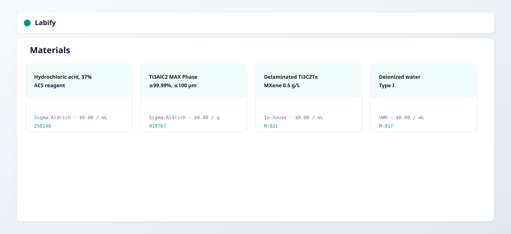
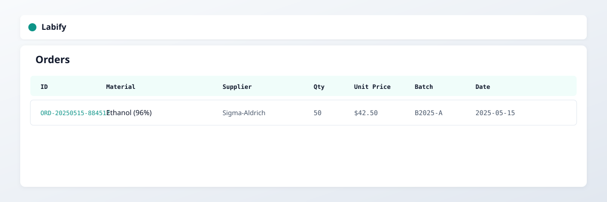
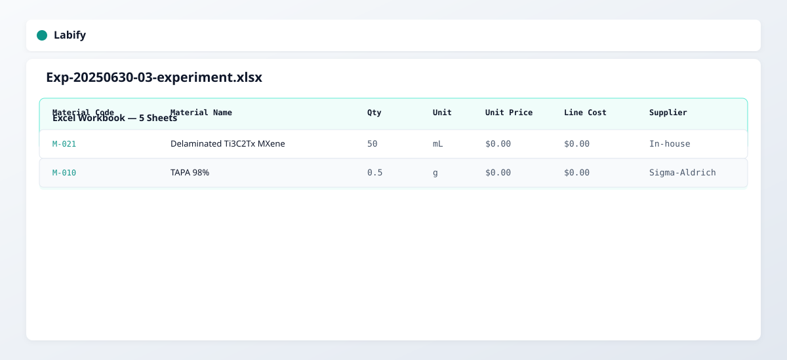
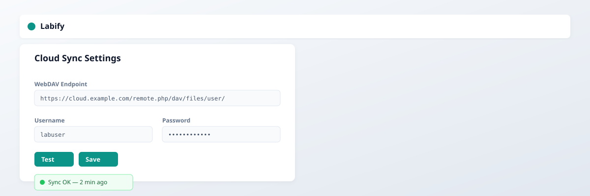

# Labify 🧪

A professional, offline-first **laboratory management system** for tracking experiments, materials, tools, suppliers, procurement orders, and inventory — with cloud sync and Excel export.

[](https://react.dev)
[](https://www.typescriptlang.org)
[](https://vitejs.dev)
[](LICENSE)

---

## ✨ Features

- **📋 Experiments** — Track protocol IDs (`EXP-YYYYMMDD-NN`), timelines, linked materials & instruments, cost estimates, and external document links.
- **🧪 Materials Catalog** — Full catalog with supplier links, images, units of measure (mL, g, unit, L), consumable vs. equipment flags.
- **🔧 Tools & Instruments** — Inventory of lab equipment with supplier info, pricing, and quantity.
- **🏢 Suppliers** — Centralized supplier directory with direct product page links.
- **📦 Orders** — Procurement workflow: add from experiment → mark as received → auto-convert to inventory.
- **📊 Inventory** — Live stock tracking with batch numbers, received dates, and delete/consumption tracking.
- **📁 Attachments** — Upload documents and images (base64) directly to experiments and materials.
- **📤 Excel Export** — Export any view or full per-experiment multi-sheet workbooks (Overview · Materials · Instruments · Cost Summary · Documents).
- **☁️ Cloud Sync** — Optional WebDAV backup with auto-debounce sync and status indicators.
- **🌗 Theme Toggle** — Light / dark mode with persistent preference.
- **🔍 Global Search** — Search/filter across all tables and card grids.
- **💾 Fully Offline** — All data persists in IndexedDB (browser-native). No backend required.

---

## 🖼️ Screenshots

| Light Mode | Dark Mode |
|:---|:---|
|  |  |
| *Experiments dashboard with expandable detail rows* | *Same view in dark mode* |

| Materials | Orders |
|:---|:---|
|  |  |
| *Material cards with Sigma-Aldrich product images* | *Procurement orders with batch tracking* |

| Excel Export | Cloud Sync |
|:---|:---|
|  |  |
| *Multi-sheet experiment workbook* | *WebDAV settings & sync status* |

---

## 🚀 Quick Start

```bash
# 1. Clone the repo
git clone https://github.com/YOUR_USERNAME/labify.git
cd labify

# 2. Install dependencies
npm install

# 3. Start the dev server
npm run dev
```

Then open http://localhost:5173 in your browser.

---

## 🏗 Architecture

```
labify/
├── src/
│   ├── db.ts           # IndexedDB layer (stores: suppliers, materials, instruments,
│   │                   #   experiments, orders, inventory)
│   ├── store.tsx       # React Context + useReducer state management
│   ├── sync.ts         # WebDAV sync manager (auto-backup on every CRUD change)
│   ├── webdav.ts       # WebDAV client
│   ├── export.ts       # Excel export utilities (xlsx)
│   ├── types.ts        # Core TypeScript interfaces
│   ├── theme.tsx       # Light/dark theme provider
│   ├── main.tsx        # Vite entry point
│   ├── App.tsx         # Shell layout + router
│   └── components/
│       ├── Experiments.tsx    # Experiment CRUD + cost calculator
│       ├── Materials.tsx      # Material catalog + image upload
│       ├── Instruments.tsx    # Tool inventory
│       ├── Suppliers.tsx      # Supplier directory
│       ├── Orders.tsx         # Procurement orders
│       ├── Inventory.tsx      # Received stock tracking
│       ├── Modal.tsx          # Reusable modal overlay
│       ├── Settings.tsx       # WebDAV configuration
│       └── Attachments.tsx    # File upload/download helpers
├── public/             # Static assets
├── index.html
├── vite.config.ts
├── tsconfig.json
└── package.json
```

---

## 📦 Seed Data

Labify ships with pre-loaded example data extracted from real research literature:

- **Sigma-Aldrich materials**: HCl, PVA, HF, LiF, MAX Ti₃AlC₂
- **Paper-derived workflow**: *High-Speed Ionic Synaptic Memory Based on 2D Titanium Carbide MXene* (Adv. Funct. Mater. 2022)
  - Experiment: Ti₃AlC₂ MAX Phase Synthesis
  - Experiment: Ti₃C₂Tₓ MXene Etching & Delamination
  - Experiment: MXene-ECRAM Synaptic Memory Device Fabrication
- **Tools**: Keithley 4200A-SCS, Keysight DSOS054A, Hitachi S4800 SEM, PANalytical X'Pert PRO, StratoSequence VI LbL robot, etc.

---

## ☁️ WebDAV Cloud Sync Setup

1. Open **Settings** (gear icon in sidebar footer)
2. Enter your WebDAV endpoint, e.g.:
   - Nextcloud: `https://cloud.example.com/remote.php/dav/files/username/`
   - Any WebDAV server: `https://dav.example.com/`
3. Fill in username + password (or token)
4. Click **Test** to verify, then **Save**

Sync is **automatic** — every add/edit/delete triggers a backup to `labify-backup.json` on your WebDAV server within ~800ms.

---

## 🧪 Adding Experiments from Literature

Labify is designed for reproducible research. To add an experiment from a paper:

1. Add all materials to the catalog (with units, supplier links, images)
2. Add required instruments
3. Create a new experiment, assign materials + quantities + units
4. Link external documents (URLs) or upload PDFs
5. Export as Excel for your lab notebook

---

## 📝 Tech Stack

| Layer | Choice |
|-------|--------|
| Framework | React 18 + TypeScript |
| Build | Vite 5 |
| Styling | Pure CSS (no UI framework) — teal/cyan accent palette |
| Storage | IndexedDB (`LabifyDB`, versioned schema) |
| Sync | WebDAV (custom client with `markDirty` debounce) |
| Export | `xlsx` library |
| Icons | Lucide React |

---

## 🎯 Design Decisions

- **No external UI library** — keeps the bundle small and styling fully customizable
- **IndexedDB > localStorage** — handles large attachments (base64 images/documents) and structured queries
- **Catalog vs. Stock split** — `Material` = catalog entry only; `Order` = pending procurement; `InventoryItem` = received stock. This prevents stale quantities in the catalog.
- **Experiment IDs are deterministic** — `EXP-YYYYMMDD-NN` format for easy lab notebook reference
- **Cost calculation** — `Σ(materialQty × price) + Σ(instrumentQty × price)` gives real-time experiment budget estimates

---

## 📄 License

MIT © 2025

---

## 🤝 Contributing

Pull requests welcome! Good first issues:
- Add barcode/QR scanning for inventory
- Add experiment templates (clone from existing)
- Add local PDF viewer for attachments
- Dark-mode-aware chart visualizations
- PWA manifest + service worker for offline install

---

*Built for scientists who need their lab data to stay organized, portable, and fully under their control.* 🔬
